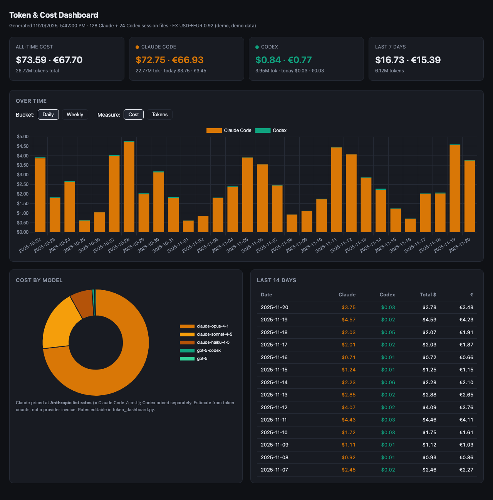

# Token & Cost Dashboard for Claude Code and Codex

A single-file, zero-dependency tool that reads the session logs Claude Code and
Codex already write to your disk, then builds a self-contained HTML dashboard
showing tokens consumed and estimated cost — per day, per week, and all-time.

- **No dependencies.** Pure Python standard library (Python 3.7+).
- **No server.** Output is one self-contained `dashboard.html` you double-click.
- **Cross-platform.** macOS, Linux, and Windows.
- **Private.** All data stays on your machine; only an optional FX-rate lookup
  touches the network.



> The screenshot above uses synthetic demo data, not real usage.

## Quick start

```bash
python3 token_dashboard.py
```

This runs an environment check, builds `dashboard.html` next to the script, and
opens it in your browser.

### Other commands

```bash
python3 token_dashboard.py --no-open    # build only, don't open the browser
python3 token_dashboard.py --check      # environment preflight only, then exit
python3 token_dashboard.py --install    # build + auto-refresh every 10 minutes
python3 token_dashboard.py --uninstall  # remove the scheduled auto-refresh
```

## Auto-refresh

`--install` schedules a background refresh every 10 minutes using the native
scheduler for your OS:

| OS      | Mechanism                                            |
|---------|------------------------------------------------------|
| macOS   | launchd LaunchAgent                                  |
| Linux   | `systemd --user` timer (falls back to a crontab job) |
| Windows | Scheduled Task (`schtasks`)                          |

`--uninstall` removes whichever job was created. It leaves the generated
`dashboard.html` and the script in place — to remove everything, delete the
folder afterwards.

### Check whether the auto-refresh job is installed

The job is registered under the id `io.github.tokendashboard` (Windows uses the
task name `TokenDashboard`). To check whether it's currently installed:

**macOS (launchd)**

```bash
launchctl list | grep io.github.tokendashboard     # a line = installed
ls ~/Library/LaunchAgents/io.github.tokendashboard.plist
```

**Linux (systemd --user)**

```bash
systemctl --user list-timers io.github.tokendashboard.timer
systemctl --user is-enabled io.github.tokendashboard.timer   # "enabled" = installed
```

If your system used the crontab fallback instead of systemd:

```bash
crontab -l | grep io.github.tokendashboard
```

**Windows (Scheduled Task)**

```powershell
schtasks /Query /TN TokenDashboard          # lists the task, or errors if absent
# PowerShell alternative:
Get-ScheduledTask -TaskName TokenDashboard
```

On any platform, you can also just check the freshness of the generated
`dashboard.html` (its header shows a "Generated …" timestamp) — if it updates on
its own every ~10 minutes, the job is running.

## Where the data comes from

| Tool        | Location                          | Field used                               |
|-------------|-----------------------------------|------------------------------------------|
| Claude Code | `~/.claude/projects/**/*.jsonl`   | assistant `message.usage` per record     |
| Codex       | `~/.codex/sessions/**/*.jsonl`    | `token_count` events' `last_token_usage` |

The tool aborts (exit code 2) if your Python is too old, or if **neither**
tool's logs are present — there would be nothing to report.

## A note on cost accuracy

Costs are an **estimate**: token counts multiplied by a per-model rate table,
not a provider invoice. The Claude rates are Anthropic's published list prices —
the same numbers Claude Code's own `/cost` command uses — so the Claude totals
match `/cost`. Edit the `PRICES` table at the top of `token_dashboard.py` to
match the rates you actually pay.

## License

[GPL-3.0](LICENSE)
